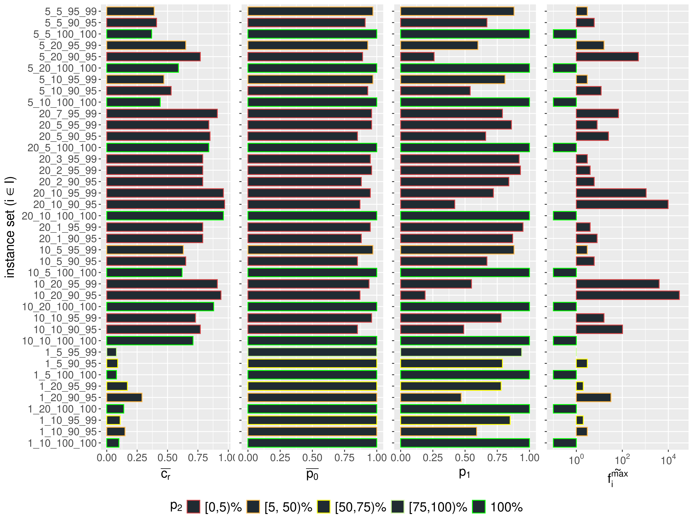
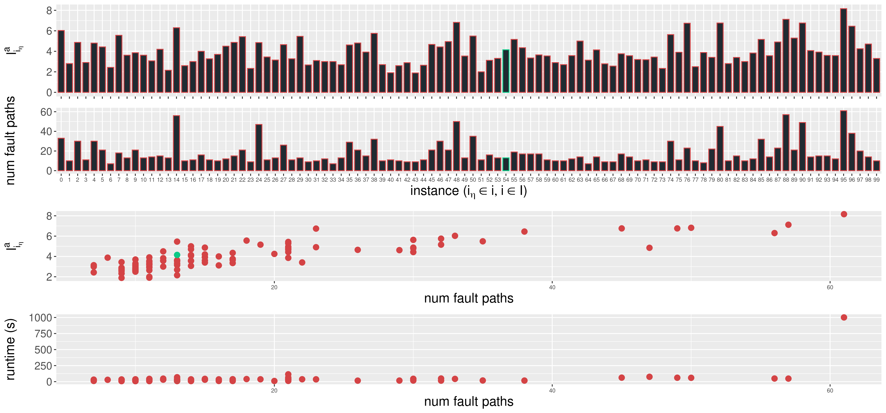
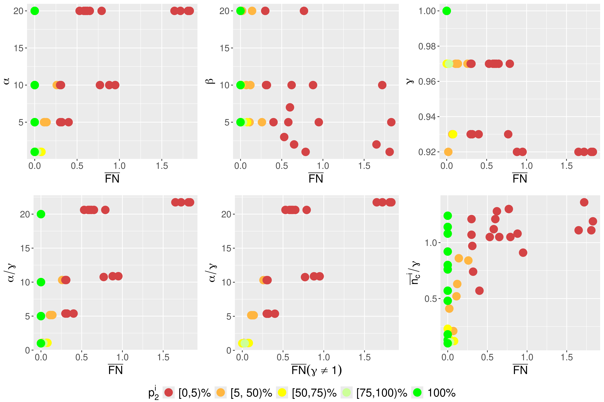

# Neuro-Symbolic Diagnosis Benchmark


[](https://opensource.org/licenses/MIT)

Evaluation benchmark for neuro-symbolic (**Symbolic[Neuro]**) diagnosis systems.

> This repository focuses on a systematic evaluation of the [neuro-symbolic diagnosis architecture](https://dl.acm.org/doi/10.1145/3587259.3627546) using randomized, parametrized synthetic problem instances and corresponding ground truth solutions generated based on the established formalism. It enables a quantitative approach even in cases where there is a lack of sensor data and expert knowledge.

The following figure shows an abstract overview of the evaluation process. The details can be found in the paper.


It essentially assesses the interplay of several modules that together form the neuro-symbolic diagnosis framework:
- [nesy_diag_smach](https://github.com/tbohne/nesy_diag_smach) generalizing [vehicle_diag_smac](https://github.com/tbohne/vehicle_diag_smach)
- [nesy_diag_ontology](https://github.com/tbohne/nesy_diag_ontology) generalizinig [obd_ontology](https://github.com/tbohne/obd_ontology)
- [oscillogram_classification](https://github.com/tbohne/oscillogram_classification)

## Dependencies

- for Python requirements, cf. `requirements.txt`
- [**Apache Jena Fuseki**](https://jena.apache.org/documentation/fuseki2/): SPARQL server hosting / maintaining the knowledge graph

## Installation

Install diagnosis benchmark and dependencies:
```
$ git clone https://github.com/tbohne/nesy_diag_bench.git
$ cd nesy_diag_bench/
$ pip install .
```
Set up *Apache Jena Fuseki* server:
```
$ cd ..
$ curl -L https://dlcdn.apache.org/jena/binaries/apache-jena-fuseki-VERSION.tar.gz > apache-jena-fuseki-VERSION.tar.gz
$ tar -xvzf apache-jena-fuseki-VERSION.tar.gz
$ chmod +x apache-jena-fuseki-VERSION/fuseki-server
```
For configuration, i.e., hosting the knowledge graph, cf. [nesy_diag_ontology](https://github.com/tbohne/nesy_diag_ontology) (section "*Launch knowledge graph from RDF serialization (e.g., `.nq.gz` / `.nt` / `.owl` / `.ttl` file*")).

## Usage

Run knowledge graph server from *Apache Jena Fuseki* root directory (runs at `localhost:3030`):
```
$ ./apache-jena-fuseki-VERSION/fuseki-server
```

*Instance set generation:*
```
$ python nesy_diag_bench/instance_gen.py --seed 42 --components 129 --anomaly-percentage 0.1 --affected-by-ub-percentage 0.2 --fault-path-comp-ub-percentage 0.5 --distractor-ub-percentage 0.5 --instances-per-conf 100 --model-acc-lb 0.6 --model-acc-ub 0.95 [--sim-classification-models] [--extend-kg]
```

*Evaluation (solving):*
```
$ python nesy_diag_bench/eval.py --instances instances/ [--v] [--sim]
```

*Generation of cumulative results:*
```
$ python nesy_diag_bench/analyze_res.py --instance-set-sol exp_solutions/
```

*Result preprocessing / accumulation (in `analysis/`):*
```
python preprocess_res.py
python meta_analysis.py
python meta_analysis_instance.py
```

*R scripts for visualizing results (in `analysis/`):*

*It is advisable to start with `plot_gen_cumulative_res.R`, as this script also installs the required R libraries.*
```
Rscript plot_gen_cumulative_res.R
```
Sample plot:

```
Rscript plot_gen_instance_set_res.R
```
Sample plot:

```
Rscript plot_meta_analysis.R
```
Sample plot:


All generated plots are stored in `analysis/plots/`.

## Naming Scheme for Generated Instances

```
<num_comp>_<anomaly_percentage>_<affected_by_ub>_<fault_path_comp_ub>_<distractor_ub>_<model_acc_lb>_<model_acc_ub>_<seed>_<idx>.json
```

Each generated instance consists of two files, e.g.:
- instance file: `129_1_5_50_10_95_99_42_0.json`
- corresponding KG: `129_1_5_50_10_95_99_42_0.nt`

The raw solution file is a single `.csv` file, e.g., `129_1_5_50_10_95_99_42.csv`.

## Parameter Config for the Experiments

The semantics of all specified parameters are defined in the paper. All parameters considered are either set to practically plausible, domain-agnostic values or intervals were specified, the limits of which are empirically justified in the paper.

- $C \in [10, 25, 50, 75, 100, 250, 500, 1000]$
- $\alpha \in [.01, .02, .03, .05, .1, .15, .2]$
- $\beta \in [.05, .1, .2]$
- $\gamma^{LB} \in [.65, .75, .85, .90, .95, 1.0]$
- $\gamma^{UB} \in [.75, .85, .95, .95, .99, 1.0]$
- $\delta \in [.05, .1, .25, .5]$
- $\epsilon \in [.25, .5, 1.0]$

## Reduced Parameter Config Used in the Paper

- $C := 129$
- $\alpha \in [.01, .05, .1, .2]$
- $\beta \in [.05, .1, .2]$
- $\gamma^{LB} \in [.90, .95, 1.0]$
- $\gamma^{UB} \in [.95, .99, 1.0]$
- $\delta := .1$
- $\epsilon := .5$

All the cumulative results of the performed experiments are stored in `analysis/results/`. The entire raw results are stored in `res/exp_solutions.zip`. To be able to reproduce the results, the synthetic instance sets are stored in `res/exp_instance_sets.zip`.

## Related Publications

```bibtex
@inproceedings{10.1145/3587259.3627546,
    author = {Bohne, Tim and Windler, Anne-Kathrin Patricia and Atzmueller, Martin},
    title = {A Neuro-Symbolic Approach for Anomaly Detection and Complex Fault Diagnosis Exemplified in the Automotive Domain},
    year = {2023},
    isbn = {9798400701412},
    publisher = {Association for Computing Machinery},
    address = {New York, NY, USA},
    url = {https://doi.org/10.1145/3587259.3627546},
    doi = {10.1145/3587259.3627546},
    booktitle = {Proceedings of the 12th Knowledge Capture Conference 2023},
    pages = {35–43},
    numpages = {9},
    location = {Pensacola, FL, USA},
    series = {K-CAP '23}
}
```

## Component -> UCR Dataset (`UCRArchive_2018`) Mapping

|component | dataset        | model | test_data | precision | accuracy | recall | architecture | #train | #test | len    | #classes | desc                                          |
|----------|----------------|-------|-----------|-----------|----------|--------|--------------|--------|-------|--------|----------|-----------------------------------------------|
| C0       | Coffee (ID 10) | C0.h5 | C0.tsv    | 1.0       | 1.0      | 1.0    | FCN          | 28     | 28    | 286    | 2        | spectrographs: dist. Robusta / Arabica coffee |
